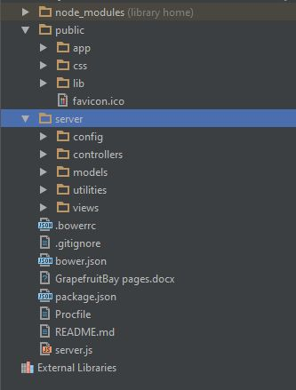

# GBay
### Web application for online market, offers books, different stationaries, games and movies.

## Application structure
!

### Users and roles
The website offers different accessibility options and functionality for admins, users or visitors. Anyone can browse the site and view the home page, login and register screens, various ad details. Visitors can also search by different criteria.

Admin users can create, update or delete other users and also to change their roles(They can ban users for example). They can also add, edit or delete different products.

### Products
Products have many properties that offer users various filters when searching. 

There are several views, showing details, search options, the paged and sorted results of various searches, etc.
All products provide detailed and through information and photos.

## Routes and functionality
```Javascript
	app.get('/', controllers.home.getAllProducts);
//USERS
    app.get('/api/users', auth.isInRole('admin'), controllers.users.getAllUsers);
    app.post('/api/users', controllers.users.createUser);
    app.put('/api/users', auth.isAuthenticated, controllers.users.updateUser);
	app.post('/login', auth.login);
    app.post('/logout', auth.logout);

    app.get('/signup', function (req, res) {
        console.log("RENDER SIGNUP");
        res.render('account/signup');
    });
//BOOKS
    app.get('/books', controllers.books.getAllBooks);
    app.post('/books', controllers.books.createBook);
    app.get('/books/:id', controllers.books.getBookById);
    app.put('/books/', controllers.books.updateBook);
    app.delete('/books/:id', controllers.books.removeBook);
    app.put('/books/:id', controllers.books.addComment);
    app.put('/books/review/:id', controllers.books.addComment);
//GAMES
    app.get('/games', controllers.games.getAllGames);
    app.get('/games/:id', controllers.games.getGameById);
    app.post('/games', controllers.games.createGame);
//MOVIES
    app.get('/movies', controllers.movies.getAllMovies);
    app.post('/movies', controllers.movies.createMovie);
    app.get('/movies/:id', controllers.movies.getMovieById);
    app.put('/movies/', controllers.movies.updateMovie);
    app.delete('/movies/:id', controllers.movies.removeMovie);
    app.put('/movies/:id', controllers.movies.addComment);
    app.put('/movies/review/:id', controllers.movies.addComment);
//STATIONERIES
    app.get('/stationeries', controllers.stationeries.getAllStationeries);
    app.post('/stationeries', controllers.stationeries.createStationery);
    app.get('/stationeries/:id', controllers.stationeries.getStationeryById);
    app.put('/stationeries/', controllers.stationeries.updateStationery);
    app.delete('/stationeries/:id', controllers.stationeries.removeStationery);
    app.put('/stationeries/:id', controllers.stationeries.addComment);
    app.put('/stationeries/review/:id', controllers.stationeries.addComment);   
//HOME
    app.get('/api/*', function(req, res) {
        res.status(404);
        res.end();
    });

    app.get('*', function(req, res) {
        res.render('index', {currentUser: req.user});
    });
```
The application provides server-side paging, sorting, and filtering.
There are several levels of validation of data - at the client, in some of the controllers, and in the data-base models.
## Presentation
The site presents the relevant information in an intuitive, easy to use way. The good user experience is enhanced by several tables and a Kendo UI Grid that offer multiple searching, sorting, and paging options.
Most of every important user action results in a user-friendly success or error notification.